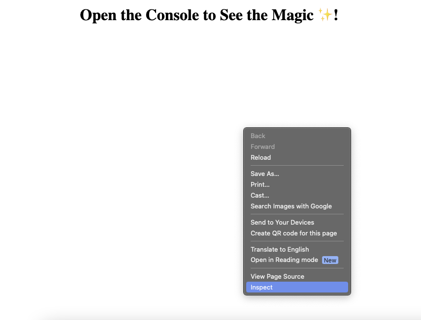
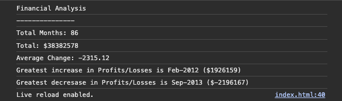

# Console-Finances

## Description

This repository applies the principles covered in JavaScript fundamentals to solve a practical scenario. The objective was to develop code for analyzing a company's financial records using a provided financial dataset.

## Usage

The analysis can be seen from: https://raihanali29.github.io/Console-Finances/.

After the webpage has loaded, right-click anywhere within its body (the white area) and choose Inspect (typically the last option in the pop-up menu) as depicted below.
 

 

The results of the financial analysis:
 

## Credits

Materials used to facilitate the learning experience can be found via the links below:

- https://jschallenger.com
- https://github.com/ALayendecker/UK-JS-ReviewDrills/blob/main/Review/fundamentals.js
- https://stackoverflow.com/questions/10623635/combine-2-arrays-into-a-multidimensional-array 

## Acknowledgements
This was done collectively during a group study session within my Pod community. 
